# ⚡ GitCircuit Action

> **A GitHub Action that turns your contribution history into an animated, pulsing microchip circuit board.**

Your commits solder components onto a motherboard, your star counts accelerate voltage pulses through copper paths, unresolved issues trigger red warning sparks, and active streaks charge up a side-mounted LED power bar.



---

## 💻 How It Works

This action queries your public profile metrics and generates a custom vector SVG. Using SVG dasharray properties and CSS keyframes, it routes glowing electrical current pulses along PCB path traces, flashes onboard status LEDs, and generates spark graphics on components when issues remain unresolved.

### The PCB Mapping

| GitHub Entity | Board Counterpart |
|---|---|
| 📦 Weekly Commits | Electronic component size/type (Resistor, Chip, CPU) |
| ⚡ Star Count | Clock frequency (MHz) & active voltage pulse speeds |
| 🐛 Open Issues | Short circuit warning sparks & indicator status |
| 🔌 Closed Issues | Ribbon cable connector bridges linking segments |
| 🎨 Top Language | PCB Soldermask base color (JS=black/gold, TS=blue, Python=green) |
| 🔥 Active Streak | Segmented LED power gauge (0-100% capacity) |

---

## 🚀 Setup (2 Steps)

### Step 1: Add the workflow to your profile repository
Create a workflow file in your profile repository (e.g., `Dasmat13/Dasmat13`) at:
`.github/workflows/circuit.yml`

Paste the following:

```yaml
name: GitCircuit — Update Profile

on:
  schedule:
    - cron: '0 20 * * *'   # Runs daily
  workflow_dispatch:

jobs:
  circuit:
    runs-on: ubuntu-latest
    permissions:
      contents: write
    steps:
      - uses: actions/checkout@v4

      - name: Generate GitCircuit SVG
        uses: Dasmat13/git-circuit-action@main
        with:
          github_user_name: ${{ github.actor }}
          github_token: ${{ secrets.GITHUB_TOKEN }}
          svg_out_path: dist/circuit.svg

      - name: Commit & Push SVG
        run: |
          git config user.name  "github-actions[bot]"
          git config user.email "github-actions[bot]@users.noreply.github.com"
          git add dist/circuit.svg
          git diff --cached --quiet || git commit -m "⚡ Update GitCircuit [$(date +'%Y-%m-%d')]"
          git push
```

### Step 2: Add to your profile README.md

Add this Markdown image link:

```markdown

```

Trigger the Action manually once, and watch your board boot up!

---

## 🛠️ Local Development

```bash
git clone https://github.com/Dasmat13/git-circuit-action.git
cd git-circuit-action
npm install
npm run build
```

---

## 📄 License

MIT © [Dasmat13](https://github.com/Dasmat13)
